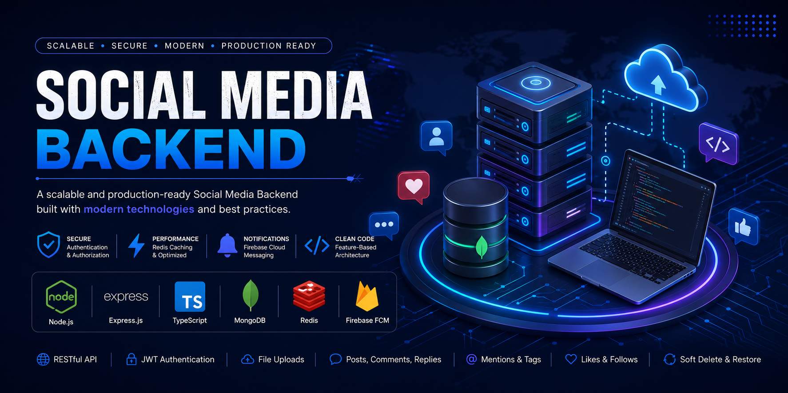

<p align="center">
  
</p>

<h1 align="center">🚀 Social Media Backend</h1>

<p align="center">
A scalable and production-ready Social Media Backend built with <strong>TypeScript</strong>, <strong>Node.js</strong>, <strong>Express.js</strong>, and <strong>MongoDB</strong>.
</p>

<p align="center">
Feature-Based Architecture • REST API • Redis • Firebase Cloud Messaging
</p>

<p align="center">


</p>

---

# 📖 About

Social Media Backend is a scalable backend application that simulates the core functionality of a modern social media platform.

The project follows a **Feature-Based Architecture** and focuses on building clean, maintainable, reusable, and scalable backend services using TypeScript.

It includes authentication, authorization, posts, comments, replies, notifications, media uploads, caching, and push notifications while following backend best practices.

> 🚀 **Part 1** of this repository focuses on the RESTful API.
>
> **Part 2** will introduce **GraphQL**, **Apollo Server**, **Socket.IO**, and **Real-Time Communication**.

---

# ✨ Features

## 🔐 Authentication

- User Registration
- Login
- JWT Authentication
- Email Verification (OTP)
- Forgot Password
- Reset Password
- Authorization
- Protected Routes

---

## 👤 User Module

- User Profile
- Update Profile
- Search Users
- Upload Profile Image
- Delete Profile Image

---

## 📝 Posts

- Create Post
- Update Post
- Delete Post
- Restore Post
- Upload Multiple Images
- Privacy Settings
- Mentions
- Tags
- Pagination
- Filtering

---

## 💬 Comments

- Create Comment
- Update Comment
- Delete Comment
- Restore Comment
- Retrieve Comments

---

## 💭 Replies

- Create Reply
- Update Reply
- Delete Reply
- Nested Replies

---

## 🔔 Notifications

- Firebase Cloud Messaging (FCM)
- Mention Notifications
- Read Notifications
- Unread Notifications
- Delete Notifications

---

## ⚡ Performance

- Redis Caching
- OTP Storage
- Optimized Queries
- Repository Pattern
- Soft Delete & Restore

---

# 🛠 Tech Stack

## Backend

- TypeScript
- Node.js
- Express.js

## Database

- MongoDB
- Mongoose

## Authentication

- JWT
- Bcrypt

## Notifications

- Firebase Cloud Messaging (FCM)

## Caching

- Redis

## File Upload

- Multer

## Email

- Nodemailer

---

# 📂 Project Structure

```text
src
│
├── common
│   ├── decorators
│   ├── middleware
│   ├── interfaces
│   ├── services
│   ├── enums
│   ├── utils
│   └── validation
│
├── config
│
├── DB
│   ├── connection
│   ├── models
│   └── repositories
│
├── modules
│   ├── auth
│   ├── user
│   ├── post
│   ├── comment
│   ├── reply
│   └── notification
│
├── uploads
│
├── app.ts
└── server.ts
```
---

# ⚙️ Installation

Clone the repository

```bash
git clone https://github.com/Rahma108/Social-Media-App-Backend.git
```

Go to the project directory

```bash
cd Social-Media-App-Backend
```

Install dependencies

```bash
npm install
```

---

# 🔑 Environment Variables

Create a `.env` file in the root directory.

```env
PORT=3000

DB_URI=

JWT_SECRET=

EMAIL=

EMAIL_PASS=

REDIS_URL=

FIREBASE_PROJECT_ID=

FIREBASE_CLIENT_EMAIL=

FIREBASE_PRIVATE_KEY=
```

---

# ▶️ Run Project

### Development

```bash
npm run start:dev
```

### Production

```bash
npm run build

npm run start:prod
```

---

# 📘 API Documentation

## REST API Documentation

Complete Postman Documentation:

👉 https://documenter.getpostman.com/view/56665483/2sBY4PNzud

---

## Available REST Modules

- Authentication
- Users
- Posts
- Comments
- Replies
- Notifications

---

## Authentication

The API uses **JWT Authentication**.

Include your access token in the request header:

```http
Authorization: Bearer YOUR_ACCESS_TOKEN
```

---

# 🧪 API Features

### Authentication

- Register
- Login
- Verify Email
- Forget Password
- Reset Password

### User

- Profile
- Update Profile
- Upload Profile Image
- Delete Profile Image
- Search Users

### Posts

- Create
- Update
- Delete
- Restore
- Pagination
- Privacy
- Tags
- Mentions

### Comments

- Create
- Update
- Delete
- Restore

### Replies

- Create
- Update
- Delete

### Notifications

- FCM Push Notifications
- Read Notifications
- Delete Notifications

---

# 🏗 Architecture

The project follows a **Feature-Based Architecture**.

```text
Request

↓

Routes

↓

Controllers

↓

Services

↓

Repositories

↓

MongoDB
```

Each module is isolated and contains its own:

- Controller
- Service
- Validation
- Repository
- Routes

This makes the project scalable and easy to maintain.

---

# 🚀 Performance Optimizations

- Redis Caching
- OTP stored in Redis
- Optimized MongoDB Queries
- Feature-Based Modules
- Reusable Repository Pattern
- Soft Delete & Restore
- Firebase Push Notifications
- Efficient Validation

---

# 📌 Roadmap

## ✅ Completed

- REST API
- Authentication
- Users
- Posts
- Comments
- Replies
- Notifications
- Redis
- Firebase Cloud Messaging
- Soft Delete & Restore
- Repository Pattern

---

## 🚀 Coming Soon (Part 2)

- GraphQL
- Apollo Server
- Socket.IO
- Real-Time Notifications
- Live Events
- GraphQL Authentication
- GraphQL Queries & Mutations
- WebSocket Integration

---

# 🚀 Deployment

The project can be deployed using:

- AWS
- Railway
- Render
- DigitalOcean

---

# 📸 Preview

You can add screenshots here later.

Example:

```
assets/
├── banner.png
├── postman.png
├── folder-structure.png
├── architecture.png
```

---

# 🤝 Contributing

Contributions, issues, and feature requests are welcome.

Feel free to fork the repository and submit a Pull Request.

---

# 👩‍💻 Author

## Rahma Salama

Backend Developer

- 💼 LinkedIn
  https://www.linkedin.com/in/rahma-salama/

- 💻 GitHub
  https://github.com/Rahma108

---

# 🌟 Project Highlights

✅ TypeScript

✅ Node.js

✅ Express.js

✅ MongoDB

✅ JWT Authentication

✅ Firebase Cloud Messaging

✅ Redis

✅ Repository Pattern

✅ Feature-Based Architecture

✅ Clean Code

✅ Modular Design

✅ Scalable Backend

✅ Soft Delete & Restore

---

# ⭐ Support

If you found this project useful, don't forget to leave a ⭐ on GitHub.

It really motivates me to continue building high-quality open-source projects.

---

# 📢 What's Next?

This repository currently contains **Part 1** of the project.

🚀 The next update will include:

- GraphQL
- Apollo Server
- Socket.IO
- Real-Time Communication
- Live Notifications
- GraphQL Authentication
- GraphQL Queries & Mutations

Stay tuned! ⭐